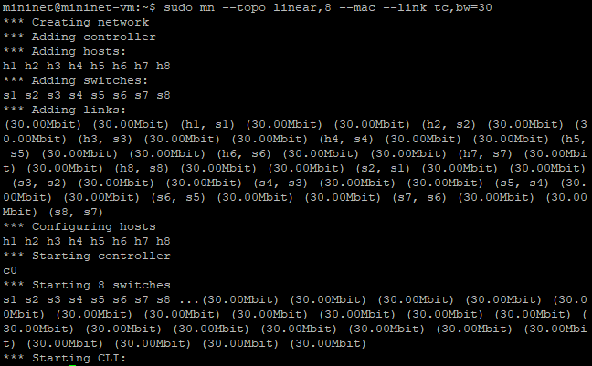
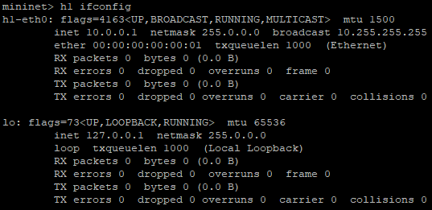
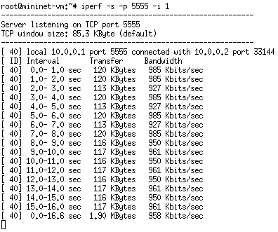
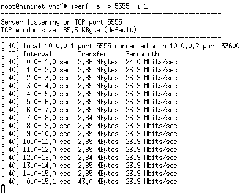

# C115 - Trabalho Final com Mininet
Este repositório contém o trabalho prático desenvolvido na disciplina C115 tendo como objetivos a criação de uma topologia linear e a criação de uma topologia customizada no Mininet. Ele inclui a definição da topologia, inspeção de interfaces, testes de conectividade e análise de desempenho em diferentes topologias de rede.

## Objetivo
O trabalho explora a criação e o teste de topologias de rede no Mininet, sendo que na primeira parte foi configurada uma topologia linear com oito hosts (h1 a h8) e oito switches (s1 a s8) para realizar testes de largura de banda e conectividade TCP usando ferramentas como iperf. Já na segunda parte foi configurada uma topologia customizada com sete hosts (h1 a h7) e sete switches (s1 a s7). O objetivo é aplicar conceitos de redes de computadores na prática.

## Primeira parte: Implementação de Topologia Linear
A topologia utilizada na primeira parte foi uma topologia linear com os seguintes parâmetros:

+ Larguras de banda: 1, 5, 10, 15, 20, 25 e 30 Mbps
+ Endereços MAC padronizados para os hosts e switches

### Comando para criação da topologia considerando largura de banda de 30 Mbps:
```
sudo mn --topo linear,8 --mac --link tc,bw=30
```
#### Saída obtida:


## Inspecionando Interfaces, Endereços MAC, IP e Portas
Após a criação da topologia, foi possível inspecionar as interfaces de rede, endereços MAC e IP dos hosts e switches, utilizando os seguintes comandos:

### 1. Listar todos os nós:


### 2. Exibir interfaces de rede do host h1:


### 3. Exibir informações das interfaces do switch s1:


### 4. Verificar as portas e mapeamentos dos hosts e switches:


### Teste de Ping
Para verificar a conectividade entre diferentes nós na topologia, foram realizados testes de ping entre os hosts:

#### h1 e h2:
##### Host h1:


##### Host h2:
 


#### h1 e h3:
##### Host h1:


##### Host h3:


Abaixo, foi criado um desenho com as principais informações da topologia: 


### Teste de Largura de Banda com Iperf
Os testes de largura de banda TCP foram realizados entre o host 1 (servidor) e o host 2 (cliente) com  larguras de banda de 1, 5, 10, 15, 20, 25 e 30 Mbps usando a ferramenta iperf.

### Teste com 1 Mbps
#### Servidor TCP no host 1 (porta 5555):


#### Cliente TCP no host 2, enviando dados por 15 segundos, com relatórios a cada 1 segundo e largura de banda de 1 Mbps:


Para uma visualização clara dos resultados de desempenho, foi gerado um gráfico utilizando o Gnuplot, que exibe o throughput (largura de banda) em Mbps a cada segundo durante o teste de 15 segundos.

#### Gráfico de Desempenho do Cliente TCP:


Este gráfico mostra a variação da largura de banda ao longo do tempo durante o teste, oferecendo uma visão detalhada da performance da comunicação TCP entre os hosts.

### Teste com 5 Mbps
#### Servidor TCP no host 1 (porta 5555):


#### Cliente TCP no host 2, enviando dados por 15 segundos, com relatórios a cada 1 segundo e largura de banda de 5 Mbps:


Para uma visualização clara dos resultados de desempenho, foi gerado um gráfico utilizando o Gnuplot, que exibe o throughput (largura de banda) em Mbps a cada segundo durante o teste de 15 segundos.

#### Gráfico de Desempenho do Cliente TCP:


Este gráfico mostra a variação da largura de banda ao longo do tempo durante o teste, oferecendo uma visão detalhada da performance da comunicação TCP entre os hosts.

### Teste com 10 Mbps
#### Servidor TCP no host 1 (porta 5555):


#### Cliente TCP no host 2, enviando dados por 15 segundos, com relatórios a cada 1 segundo e largura de banda de 10 Mbps:


Para uma visualização clara dos resultados de desempenho, foi gerado um gráfico utilizando o Gnuplot, que exibe o throughput (largura de banda) em Mbps a cada segundo durante o teste de 15 segundos.

#### Gráfico de Desempenho do Cliente TCP:


Este gráfico mostra a variação da largura de banda ao longo do tempo durante o teste, oferecendo uma visão detalhada da performance da comunicação TCP entre os hosts.

### Teste com 15 Mbps
#### Servidor TCP no host 1 (porta 5555):


#### Cliente TCP no host 2, enviando dados por 15 segundos, com relatórios a cada 1 segundo e largura de banda de 15 Mbps:


Para uma visualização clara dos resultados de desempenho, foi gerado um gráfico utilizando o Gnuplot, que exibe o throughput (largura de banda) em Mbps a cada segundo durante o teste de 15 segundos.

#### Gráfico de Desempenho do Cliente TCP:


Este gráfico mostra a variação da largura de banda ao longo do tempo durante o teste, oferecendo uma visão detalhada da performance da comunicação TCP entre os hosts.

### Teste com 20 Mbps
#### Servidor TCP no host 1 (porta 5555):


#### Cliente TCP no host 2, enviando dados por 15 segundos, com relatórios a cada 1 segundo e largura de banda de 20 Mbps:


Para uma visualização clara dos resultados de desempenho, foi gerado um gráfico utilizando o Gnuplot, que exibe o throughput (largura de banda) em Mbps a cada segundo durante o teste de 15 segundos.

#### Gráfico de Desempenho do Cliente TCP:


Este gráfico mostra a variação da largura de banda ao longo do tempo durante o teste, oferecendo uma visão detalhada da performance da comunicação TCP entre os hosts.

### Teste com 25 Mbps
#### Servidor TCP no host 1 (porta 5555):


#### Cliente TCP no host 2, enviando dados por 15 segundos, com relatórios a cada 1 segundo e largura de banda de 25 Mbps:


Para uma visualização clara dos resultados de desempenho, foi gerado um gráfico utilizando o Gnuplot, que exibe o throughput (largura de banda) em Mbps a cada segundo durante o teste de 15 segundos.

#### Gráfico de Desempenho do Cliente TCP:


Este gráfico mostra a variação da largura de banda ao longo do tempo durante o teste, oferecendo uma visão detalhada da performance da comunicação TCP entre os hosts.

### Teste com 30 Mbps
#### Servidor TCP no host 1 (porta 5555):


#### Cliente TCP no host 2, enviando dados por 15 segundos, com relatórios a cada 1 segundo e largura de banda de 30 Mbps:


Para uma visualização clara dos resultados de desempenho, foi gerado um gráfico utilizando o Gnuplot, que exibe o throughput (largura de banda) em Mbps a cada segundo durante o teste de 15 segundos.

#### Gráfico de Desempenho do Cliente TCP:


Este gráfico mostra a variação da largura de banda ao longo do tempo durante o teste, oferecendo uma visão detalhada da performance da comunicação TCP entre os hosts.

## Segunda parte: Implementação de Topologia Customizada
A topologia utilizada na segunda parte foi uma topologia customizada em Python de acordo com o layout fornecido com os seguintes parâmetros:

+ Endereços MAC padronizados para os hosts e switches
+ Controlador manual

### Comando para criação da topologia:
```
sudo mn --custom topo-7host-7sw.py --topo mytopo --controller=none --mac
```
#### Saída obtida:


O código Python com a topologia completa se encontra nos arquivos do repositório.

## Inspecionando Interfaces, Endereços MAC, IP e Portas
Após a criação da topologia, foi possível inspecionar as interfaces de rede, endereços MAC e IP dos hosts e switches, utilizando os seguintes comandos:

### 1. Listar todos os nós:


### 2. Exibir interfaces de rede do host h1:


### 3. Exibir informações das interfaces do switch s1:


### 4. Verificar as portas e mapeamentos dos hosts e switches:


Abaixo, foi criado um desenho com as principais informações da topologia: 


## Execução de testes de ping entre os diferentes nós:
Para validar a conectividade da rede, foi realizado testes de ping entre os diferentes hosts considerando os switches normais:

#### h6 e h7:
##### Host h6:


##### Host h7:
 


#### h1 e h5:
##### Host h1:


##### Host h5:
 


## Apagando Regras Anteriores e Criando Regras Baseadas em Endereços MAC
Para configurar a rede com regras baseadas em endereços MAC, foram apagadas todas as regras de fluxo existentes nos switches :
```
sudo ovs-ofctl del-flows s3
sudo ovs-ofctl del-flows s7
sudo ovs-ofctl del-flows s2
sudo ovs-ofctl del-flows s4
```
Após isso, foram adicionadas novas regras de fluxo baseadas em endereços MAC. Foram usados comandos para a configuraração de regras específicas que permitem a comunicação entre hosts dentro de um mesmo switch (h2 e h3), hosts passado por pelo menos dois switches (h6 e h7) e entre hosts distantes (h6 e h2). Ao final, foram realizados testes de ping entre os hosts:

#### h2 e h3:
##### Host h2:


##### Host h3:


#### h6 e h7:
##### Host h6:


##### Host h7:


#### h6 e h2:
##### Host h6:


##### Host h2:


## Contribuições
Contribuições são bem-vindas! Sinta-se à vontade para abrir uma issue ou enviar um pull request para melhorias e ajustes.

## Licença
Este projeto está licenciado sob a MIT License.
